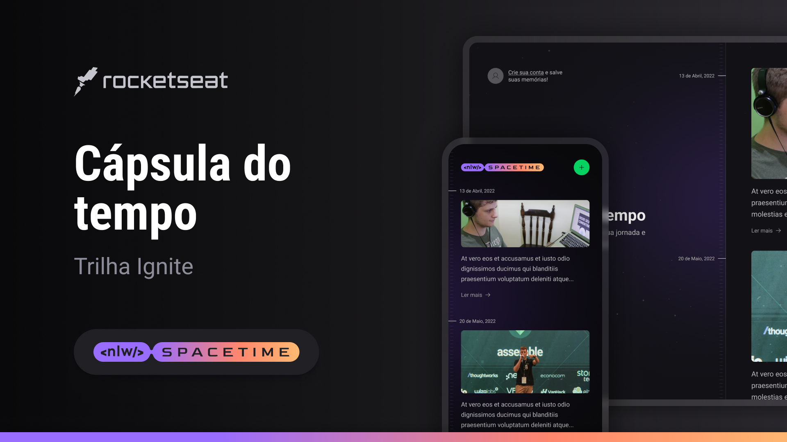

# Cápsula do Tempo || NLW Spacetime

 Esta aplicação consiste em uma máquina do tempo, onde o usuário podera guardar memórias passadas em uma timeline. Esta aplicação foi construida ao longo do evento NLW Spacetime 

  

## Stack utilizada

**Front-end:** Nextjs, Typescript, TailwindCSS

**Back-end:** NodeJS, Typescript, Fastify, Prisma

**Mobile:** React Native, Expo, Typescript, Nativewind

## Referência

- [Rocketseat](https://app.rocketseat.com.br/)
